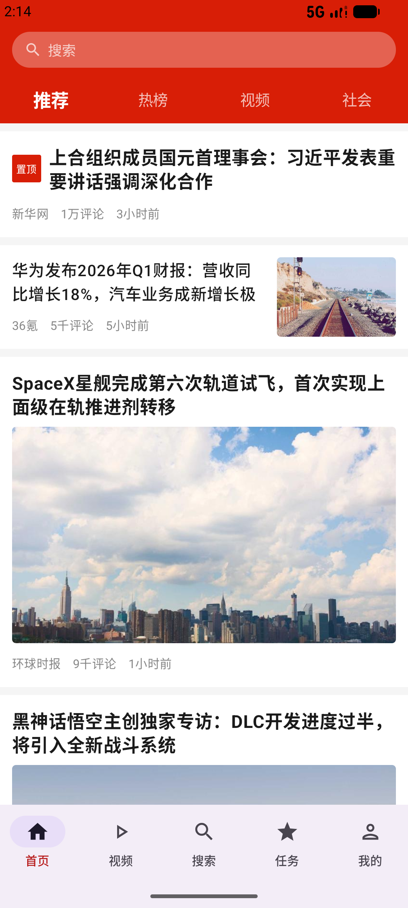

# 今日头条首页信息流 Demo

> 字节跳动客户端工程训练营课题 — 仿今日头条首页列表页
>
> Kotlin + Jetpack Compose + MVI + Clean Architecture

<p align="center">
  
</p>

---

## 技术栈

| 层级 | 技术 | 版本 |
|------|------|------|
| 语言 | Kotlin | 2.2.10 |
| UI | Jetpack Compose + Material3 | BOM 2026.02.01 |
| 架构 | MVI + Clean Architecture | — |
| 状态管理 | StateFlow | — |
| DI | Hilt + KSP | 2.59.2 |
| 网络 | Retrofit2 + OkHttp3 | 2.11.0 / 4.12.0 |
| JSON | Kotlinx Serialization | 1.8.0 |
| 图片 | Coil Compose | 2.7.0 |
| 数据库 | Room + KSP | 2.7.0 |
| 分页 | Paging3 + RemoteMediator | 3.3.0 |
| 日志 | Timber | 5.0.1 |

## 架构

```
Presentation (Compose Screen + MVI ViewModel)
    ↕ StateFlow<UiState> / (UiEvent) → Unit + LazyPagingItems
Domain (FeedCard sealed class + NewsRepository interface)
    ↕
Data (NewsRepositoryImpl → RemoteDataSource interface)
    ↕
┌─ MockDataSource (Demo: 程序化生成数据, 支持延迟/错误模拟)
└─ RealRemoteDataSource (生产: 包装 NewsApi/Retrofit)
    ↕
Room (PagingSource + RemoteMediator — 双表缓存)
```

**关键设计决策：**
- `RemoteDataSource` 接口抽象数据来源，Repository 零感知 Mock/Real 切换
- `MockDataSource` 在 Repository 层生成数据（非 OkHttp 拦截），支持 `DebugControls` 运行时配置延迟和错误
- Paging3 `RemoteMediator` 负责网络写入 Room，`PagingSource` 只读 Room，天然实现离线缓存
- 4 个频道（推荐/热榜/视频/社会）各自独立 Mock 数据集，支持 3 页分页

```
app/src/main/java/com/example/toutiao/
├── domain/model/FeedCard.kt              # 4 种卡片密封类 (@Immutable)
├── domain/repository/NewsRepository.kt   # 仓库接口
├── data/remote/datasource/
│   ├── RemoteDataSource.kt               # 数据源抽象接口
│   ├── MockDataSource.kt                 # Demo 实现（4 频道独立数据 + DebugControls）
│   ├── RealRemoteDataSource.kt           # 生产实现（包装 NewsApi）
│   └── DebugControls.kt                  # 调试控制单例（延迟/错误模拟）
├── data/remote/mediator/
│   └── NewsRemoteMediator.kt             # Paging3 RemoteMediator
├── data/remote/api/NewsApi.kt            # Retrofit 接口
├── data/remote/dto/NewsFeedResponse.kt   # Kotlinx Serialization DTO
├── data/local/entity/                    # Room 实体（feed_items + remote_keys）
├── data/local/dao/                       # Room DAO（Flow + PagingSource）
├── data/local/database/AppDatabase.kt    # Room 数据库（WAL 模式, v2）
├── data/repository/NewsRepositoryImpl.kt # 仓库实现
├── data/mapper/NewsMapper.kt             # DTO ↔ Entity ↔ Domain
├── presentation/home/                    # MVI 首页（Screen/ViewModel/State/Event）
├── presentation/home/components/         # 4 种卡片 + BottomInfoRow
├── di/                                   # Hilt（Network/Database/DataSource/Repository）
├── ui/theme/                             # 头条红 #D81E06 主题
├── ToutiaoApplication.kt                # @HiltAndroidApp + Coil ImageLoader + Timber
└── MainActivity.kt                       # @AndroidEntryPoint
```

## 功能

| 模块 | 功能 | 状态 |
|------|------|------|
| 卡片渲染 | TextTop / LeftTextRightImage / LargeImage / Video 4 种类型 | ✅ |
| 频道切换 | 顶部 TabRow：推荐 / 热榜 / 视频 / 社会（4 频道独立数据） | ✅ |
| 下拉刷新 | PullToRefreshBox + lazyPagingItems.refresh() | ✅ |
| 加载更多 | RemoteMediator LoadType.APPEND 自动触发 | ✅ |
| 状态管理 | MVI: Loading / Error / Empty / Success（loadState 驱动） | ✅ |
| 离线缓存 | Room 双表缓存 + Paging3 自动从 Room 读取 | ✅ |
| 底部导航 | 首页 / 视频 / 搜索 / 任务 / 我的 | ✅ |
| 搜索交互 | 点击展开输入框 → 提交搜索 → Mock 结果列表 | ✅ |
| "我的" 页面 | 未登录占位页（头像 + 登录按钮 + 功能入口） | ✅ |
| 调试面板 | 齿轮图标 → AlertDialog：网络延迟 0~5s + 模拟错误开关 | ✅ |
| Mock 数据源 | RemoteDataSource 抽象 + MockDataSource 4 频道独立数据集 | ✅ |
| Compose Preview | Success / Loading / Error / Empty 多状态预览 | ✅ |
| Paging3 集成 | RemoteMediator 写入 Room + PagingSource 读取 | ✅ |

## 构建与运行

```bash
# 环境要求
# - Android Studio 2025.1+
# - JDK 17+
# - Android SDK API 36

# 构建
./gradlew assembleDebug

# 安装
adb install app/build/outputs/apk/debug/app-debug.apk

# 查看日志（Timber + MockDataSource 全链路追踪）
adb logcat -s Timber:D MockDataSource:D NewsRemoteMediator:D
```

## 文档

| 文档 | 说明 |
|------|------|
| [AGENT.md](AGENT.md) | AI Agent 协作协议与项目约束 |
| [需求分析](docs/01_需求分析文档.md) | 功能需求、非功能需求、需求边界 |
| [技术设计](docs/02_技术设计文档.md) | 架构设计、状态管理、数据库、分页策略 |
| [开发文档](docs/03_开发文档.md) | 项目结构、API 接口、构建发布、调试指南 |
| [项目进度](docs/04_项目进度文档.md) | 里程碑、周报、日报 |

## License

MIT — Copyright (c) 2026 SapientialM
